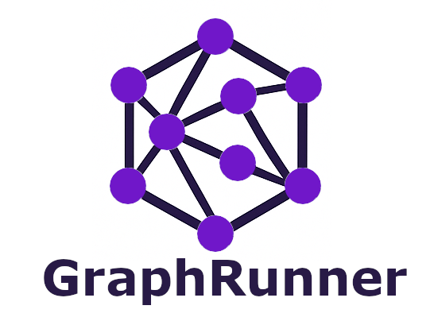

# GraphRunner

<p align="center">
  
</p>

A full-featured backend example project for building and querying a **graph database** powered by **JanusGraph**, **Cassandra**, and **Gremlin**, with a modern **TypeScript + Express** stack. This is meant to showcase an optimised version for fast, efficient data ingestion, processing and retrieval of pre-computated data from a graph database.

Includes:
- 📦 Docker-based setup (JanusGraph + Cassandra + Prometheus)
- 🧠 Clean architecture (SOLID + use cases)
- ✨ Google OAuth2 authentication 
- 📊 Prometheus-ready monitoring (Prom-client)
- 🐛 Winston logging
- 🔁 Nodemon for dev reload
- ✅ Jest for unit testing
- 📘 OpenAPI documentation with Swagger UI
- 📚 Documentation page on [Gitbook](https://graphrunner.gitbook.io/graphrunner)

---

## 🚀 Getting Started

### Prerequisites

- Node.js (v20+ recommended)
- Docker + Docker Compose
- (Optional) [DBGate](https://dbgate.org) for Cassandra GUI

### Clone & Install

```bash
git clone https://github.com/your-repo/janusgraph-node-boilerplate.git
cd janusgraph-node-boilerplate/app
npm install
```


🐳 Running the Stack
1. Start Docker services
```bash
docker-compose up --build
```

This launches:

    Cassandra (port 9042)

    JanusGraph/Gremlin Server (port 8182)

    Kafka Broker (port 9092) + Zookeeper (2181)

    Prometheus (port 9090)

    The Node.js app runs locally on port 3030

2. Start the app in dev mode
```bash
npm run dev
```

🔐 Auth Setup (Google OAuth)

Create a .env file in app/:
```bash
APP_PORT=3030

GOOGLE_CLIENT_ID=mock-client
GOOGLE_CLIENT_SECRET=mock-secret
SESSION_SECRET=keyboardcat

GREMLIN_HOST=localhost
GREMLIN_PORT=8182
GREMLIN_TRAVERSAL_SOURCE='g'
GREMLIN_MIMETYPE=application/vnd.gremlin-v3.0+json

# Kafka (used in dev and production modes)
KAFKA_MODE=local
KAFKA_BROKER_LOCALHOST=localhost:9092
KAFKA_BROKER_DOCKER=kafka:9092
```

🧪 Sample API Usage
Create a vertex:
```bash
curl -X POST http://localhost:3030/api/vertex \
  -H "Content-Type: application/json" \
  -d '{"name": "Alice", "label": "person"}'
```

Get a vertex by ID:
```bash
curl http://localhost:3030/api/vertex/{id}
```

🧰 Folder Structure

```bash
app/
├── logs/                   # Winston log files (error.log, combined.log)
├── src/
│   ├── auth/               # OAuth strategies
│   ├── config/             # Swagger, Prometheus, environment
│   ├── controllers/        # Express route handlers
│   ├── db/                 # Gremlin client setup
│   ├── kafka/              # Kafka consumer setup
│   ├── logger/             # Winston logger (logger.ts)
│   ├── monitoring/         # Prometheus metrics endpoint
│   ├── routes/             # Express route definitions
│   ├── services/           # Business logic (ingestionService, vertex/edge logic)
│   ├── utils/              # Helpers (e.g., sanitize.ts)
│   └── app.ts              # Express entry point
├── Dockerfile              # Container image
├── docker-compose.yml      # Docker services including Kafka, Zookeeper
├── package.json
├── tsconfig.json
├── .env
```

# 📊 Monitoring (Prometheus)

- Metrics endpoint: `http://localhost:3030/metrics`
- Prometheus UI: `http://localhost:9090`

### 📦 What's Included
- [`prom-client`](https://github.com/siimon/prom-client) integration for Node.js metrics
- A dedicated `/metrics` endpoint exposed by the app
- Dockerized Prometheus instance with a working `prometheus.yml`

### 🧠 What It Tracks
- Event loop lag
- Memory usage
- HTTP request durations
- Custom app metrics (extendable)

📘 API Documentation (OpenAPI)
- Swagger UI available at: [http://localhost:3030/docs](http://localhost:3000/docs)
- Describes all available endpoints (`POST`, `GET`, `PUT`, `DELETE`) for vertex operations
- Documentation auto-generated from JSDoc annotations using `swagger-jsdoc`

🛠 TODO List
- [x] Kafka integration (GraphRunner is consumer; DS will be modular producer)

- [ ] Add OAuth-based authentication & authorization (no external providers)

- [ ] Integrate Vault for managing secrets instead of .env

- [x] Full Prometheus prometheus.yml config

- [x] Prom-client integration

- [x] [GUI tool for JanusGraph](https://github.com/RORVI/janusgraph-visualizer-for-graphrunner)

- [x] Import [CESNET-TimeSeries24 dataset](https://zenodo.org/records/13382427) for more complex operations and meaningful data visualization/'approximative' import via the datasources, with faker

- [ ] Add unit and integration tests with Jest. Keep the coverage at a minimum of 70%.


🧾 License

MIT — use it, hack it, own it.